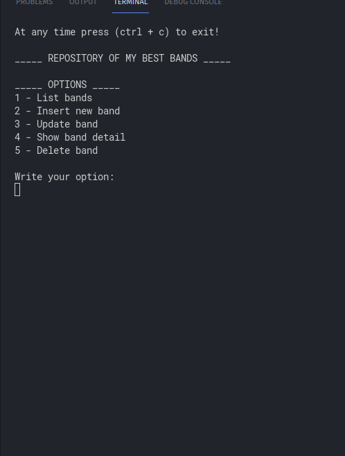
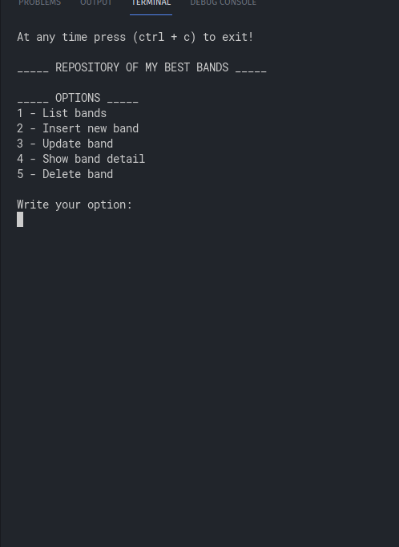

# Repositório de Registro de Bandas de Música
     

 Aplicação console desenvolvida com c# para registro de bandas de música.

  <kbd></kbd>
  <kbd></kbd>
  <kbd></kbd>

Nesse projeto foi utilizado padrões de projeto como: separação em camadas, repositórios e injeção de dependência.

Todos os campos de entrada foram validados para que não sejam inseridos valores vazios, espaços em branco, letras onde o campo é numérico e valores fora do range de opões necessários para seu funcionamento.

